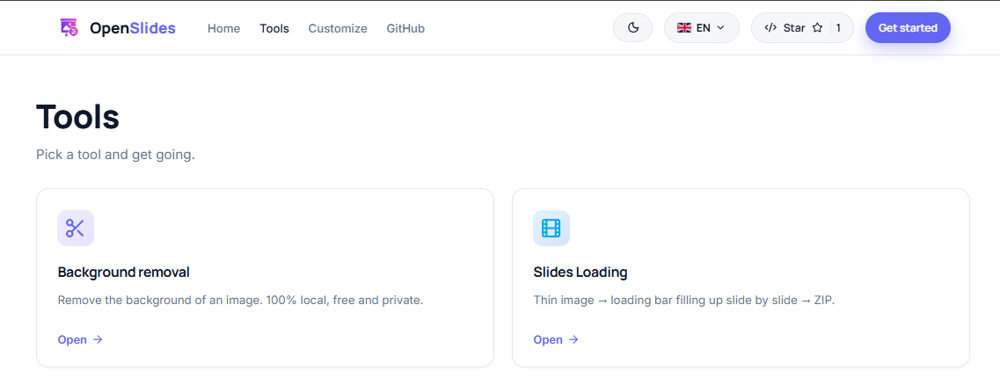
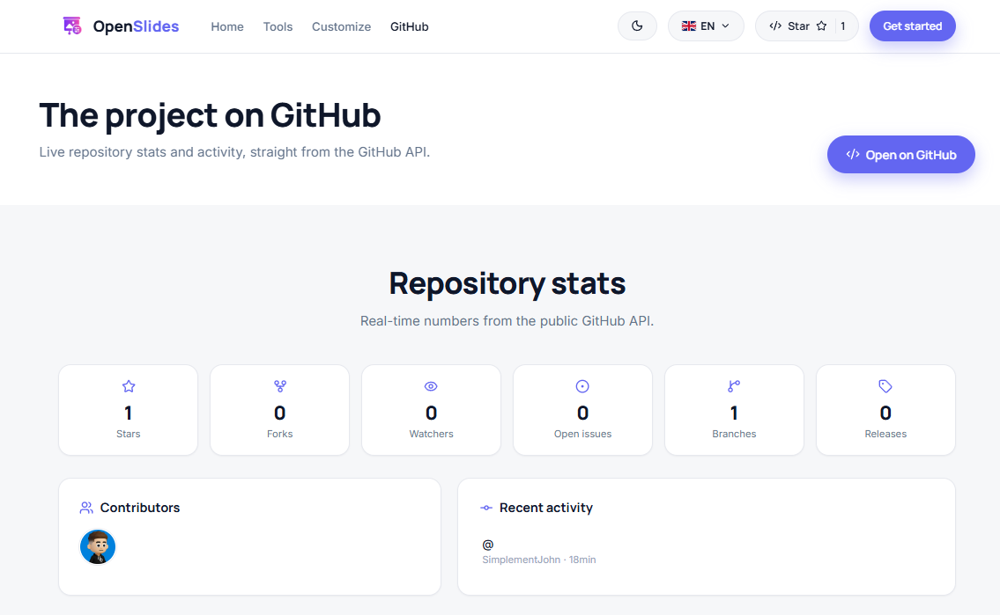

# OpenSlides Manager

Boîte à outils web pour présentations et images. Thème clair/sombre, inspiré de remove.bg : interface simple, épurée, animations fluides, rendu SaaS.

Repo : https://github.com/SimplementJohn/OpenSlides-Manager

<!-- Badges dynamiques (shields.io) -->


## Aperçu

### Accueil


### Outils


### Stats GitHub en direct


## Fonctionnalités

- **Site vitrine** — page d'accueil, outils, éditeur (maquette). Gratuit, open source, sans compte.
- **Détourage** (`/bgremover`) — retire le fond d'une image. 100% local dans le navigateur (`@imgly/background-removal`), gratuit, privé, sans clé API.
- **Slides Loading** (`/loadingslides`) — colle une image fine, choisis un nombre de diapos, et génère un ZIP de PNG où une barre de chargement (ou compteur / points) se remplit progressivement diapo par diapo.
  - Modules empilables : barre de chargement, compteur (1/N, %, n), points indicateurs.
  - Presets couleur + saisie hexa.
  - Lecteur scrub + bouton Play pour prévisualiser le défilement.

## Stack

- [Vite](https://vitejs.dev/) + [React 18](https://react.dev/)
- [React Router](https://reactrouter.com/)
- [lucide-react](https://lucide.dev/) (icônes)
- [jszip](https://stuk.github.io/jszip/) + [file-saver](https://github.com/eligrey/FileSaver.js) (export ZIP)
- [@imgly/background-removal](https://github.com/imgly/background-removal-js) (détourage local, ONNX/WASM)

Tout le traitement image se fait côté client (Canvas API). Aucun upload serveur.

## Démarrage

Prérequis : [Node.js](https://nodejs.org/) 18+.

```bash
git clone https://github.com/SimplementJohn/OpenSlides-Manager.git
cd OpenSlides-Manager
npm install
npm run dev
```

Ouvre http://localhost:5173

## Scripts

| Commande | Effet |
|----------|-------|
| `npm run dev` | Serveur de dev avec HMR |
| `npm run build` | Build de production dans `dist/` |
| `npm run preview` | Sert le build de prod localement |

## Structure

```
src/
  App.jsx              # page d'accueil (hero, features, carousel, CTA)
  main.jsx             # router + layouts
  index.css            # design system (thème clair)
  Drop.jsx             # zone d'upload image partagée (drag / clic / coller)
  i18n.jsx             # i18n FR / EN
  components/          # Navbar, Footer, Logo, Dropzone, Carousel, TemplateCard, LangToggle
  data/templates.js    # données des modèles vitrine
  pages/
    Templates.jsx      # page Outils (liens vers les outils)
    Editor.jsx         # éditeur de slides (maquette 3 zones)
    BgRemover.jsx      # outil détourage
    LoadingSlides.jsx  # outil slides loading
```

## Licence

MIT — voir [LICENSE](LICENSE).
